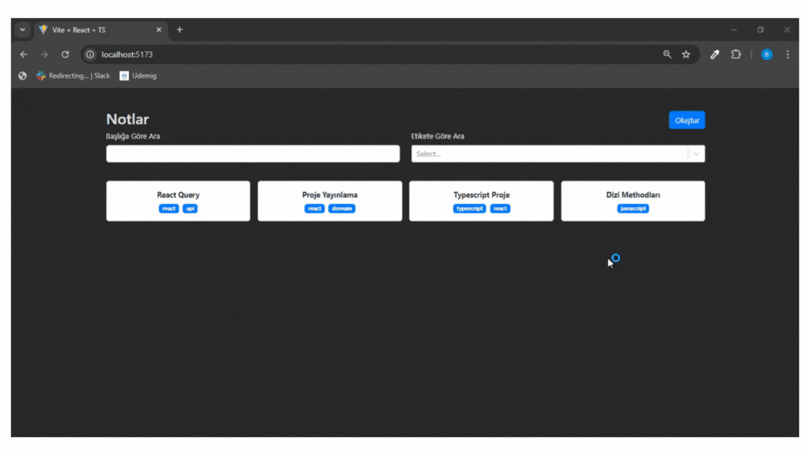

## Notes App 

- Bu, TypeScript kullanılarak oluşturulmuş basit bir Not Uygulamasıdır. Kullanıcıların verimli ve kullanıcı dostu bir arayüzde not oluşturmasına, düzenlemesine, silmesine ve görüntülemesine olanak tanır. 

### Özellikler 

- Notlar Oluşturun: Başlık ve içerikle kolayca yeni notlar ekleyin.

- Notları Düzenleyin: Mevcut notların içeriğini güncelleyin.

- Notları Silin: Artık ihtiyaç duyulmayan notları kaldırın.

- Kalıcı Depolama: Notlarınız kaydedilir ve uygulama kapatılıp yeniden açıldıktan sonra bile erişilebilir.

- Kullanıcı Dostu Arayüz: Sorunsuz gezinme için temiz ve sezgisel kullanıcı arayüzü.

### Kütüphaneler

- react-router-dom
- react-bootstrap
- bootstrap
- react-markdown
- react-select
- uuid

### Screen

<!-- # Web Projesini Yayınlama Aşamaları

1. Projenizi Hazırlayın.
2. Alan Adı (Domain) kirala. (godaddy, namecheap,isimtescil)
3. Hosting Seç
4. Projeyi Yayınla
5. DNS Ayarları yap.
6. Web sitesini kontrol et.
7. SEO Kontrolü ve Güvenlik Ayarlarını yap

# SEO - (Search Engine Optimization)

- Arama Motoru Optimizasyonu

## On-Page SEO (Site İçi SEO)

- web sitenin içeriğinni ve yapısını optimize etmeyi içerir
- anahtar kelime kullanımı
- başlık etiketleri (title) ve meta açıklamaları
- url
- içerik kalitesi ve özgünlüğü
- görsel optimizasyonlar (alt etiketleri vb.)
- proje içerisndeki linkler
- sayfa yüklenme hızları
- mobil uyumluluk

## Off-Page SEO (Site Dışı SEO)

- backlink: diğer web sitlerinden kendi sitemiz doğru gelen bağlantılar alnmak sitemizin otoritesini arttır.
- sosyal medya paylaşımları
- online incelemeler (çeşitli forumlar) yorumlar
- haberler
- konuk yazıları
- kampanyalar -->